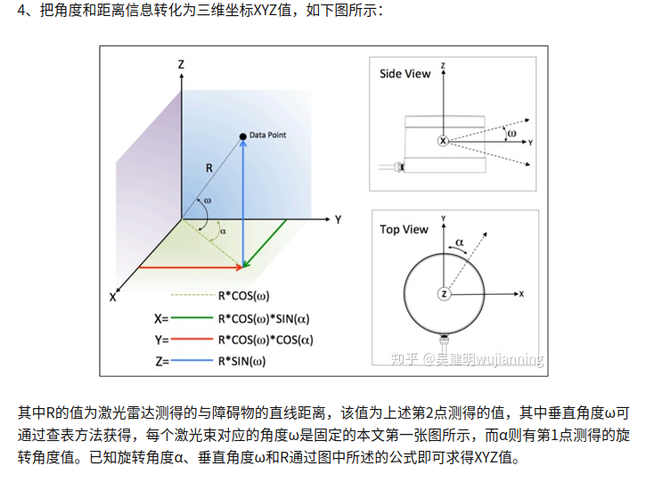

# lidar_cam_calibration
reference:

1. [https://github.com/ros-drivers/velodyne](https://github.com/ros-drivers/velodyne)
2. [https://silverwind1982.pixnet.net/blog/post/153218861](https://silverwind1982.pixnet.net/blog/post/153218861)
3. [https://github.com/UT18-Senior-Design/Object-Detection-and-Calibrations](https://github.com/UT18-Senior-Design/Object-Detection-and-Calibrations)
4. [https://github.com/ankitdhall/lidar_camera_calibration](https://github.com/ankitdhall/lidar_camera_calibration)
5. [https://arxiv.org/pdf/2011.08516.pdf](https://arxiv.org/pdf/2011.08516.pdf)

器材:

1. 一般usb cam(單眼)
2. Velodyne VLP-16


# 安裝相關功能
```
sudo apt-get install -y python-catkin-tools python-catkin-pkg python-rosdep python-wstool ros-melodic-cv-bridge ros-melodic-image-transport
sudo apt-get install -y ros-melodic-nodelet-core ros-melodic-ddynamic-reconfigure
sudo apt-get install -y ros-melodic-velodyne-pointcloud

source /opt/ros/melodic/setup.bash

# Prepare rosdep to install dependencies.
sudo rosdep init
rosdep update --include-eol-distros  # Support EOL distros.

cd lidar_camera_calibration
git checkout melodic
```


# 將要使用的 submodule update
```
git submodule update --init --recursive
```


# build
```
cd ../..
rosdep install --from-paths src --ignore-src -r -y
catkin_make -DCATKIN_WHITELIST_PACKAGES="aruco;aruco_ros;aruco_msgs"
catkin_make -DCATKIN_WHITELIST_PACKAGES="aruco_mapping;lidar_camera_calibration"
catkin_make -DCATKIN_WHITELIST_PACKAGES=""
```

流程:

1.  usb cam 校正後參數(轉換矩陣等)
2. arcuo mapping
3. arcuo mapping with lidar

LiDAR 的框架定義為 X 軸指向前方，Y 軸指向左側，Z 軸指向上方。

相機的框架被定義為Z軸指向前方，X軸指向右側，Y軸指向下方。c

- x right
- y down
- z forward

## [Axis Orientation](https://www.ros.org/reps/rep-0103.html#id21)

經過ROS 輸出vlp16座標系In relation to a body the standard is: B

- x forward
- y left
- z up

實際 vlp16手冊 A

- x right
- y forward
- z up



單眼相機校正流程

[http://wiki.ros.org/camera_calibration/Tutorials/MonocularCalibration](http://wiki.ros.org/camera_calibration/Tutorials/MonocularCalibration)

校正用棋盤格

[check-108.pdf](https://s3-us-west-2.amazonaws.com/secure.notion-static.com/f4b1e795-1852-4e34-8372-49a9ca61bae4/check-108.pdf)

Arcuo 產生器 [https://chev.me/arucogen/](https://chev.me/arucogen/)

Dictionary要選擇original

範例使用的是ID 26跟582


校正結果如下：

使用arcuo mapping 確認是否能mapping到arcuo

```jsx
<node pkg="aruco_mapping" type="aruco_mapping" name="aruco_mapping" output="screen">
    <remap from="/image_raw" to="/usb_cam/image_raw"/>

    <param name="calibration_file" type="string" value="$(find aruco_mapping)/data/usb_cam.ini" /> 
    <param name="num_of_markers" type="int" value="2" />
    <param name="marker_size" type="double" value="0.016"/>
    <param name="space_type" type="string" value="plane" />
    <param name="roi_allowed" type="bool" value="false" />

  </node>
```

將校正後的結果,如範例的usb_cam.ini在裡面更改資料

```jsx
# Prosilica camera intrinsics

[image]

width
640

height
480

[camera]

camera matrix
727.079910 0.000000 317.463020
0.000000 734.695266 240.018079
0.000000 0.000000 1.000000

distortion
0.078355 -0.382089 0.001584 0.000016 0.000000

rectification
1.000000 0.000000 0.000000
0.000000 1.000000 0.000000
0.000000 0.000000 1.000000

projection
727.703247 0.000000 317.400100 0.000000
0.000000 737.639832 240.387843 0.000000
0.000000 0.000000 1.000000 0.000000
```


# 使用terminal運行指令:
roslaunch velodyne_pointcloud VLP16_points.launch

roslaunch usb_cam usb_cam-test.launch

roslaunch lidar_camera_calibration find_transform.launch
